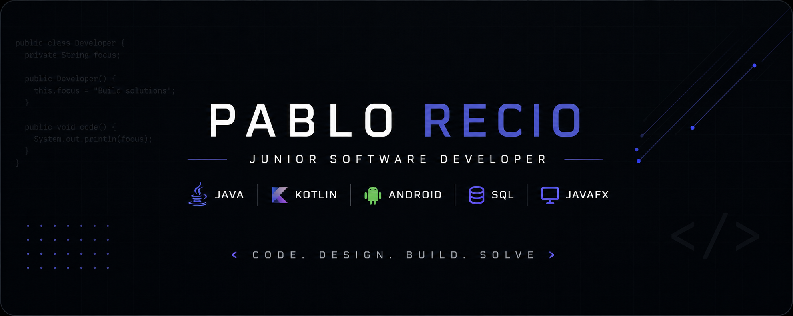

  

<h1 align="center">👋 Hola, soy Pablo Recio Oliva</h1>

  <b>Técnico Superior en Desarrollo de Aplicaciones Multiplataforma (DAM)</b>

  Actualmente continúo ampliando mis conocimientos mediante proyectos personales
  enfocados en <b>Java</b>, <b>Kotlin</b>, <b>Android</b>, <b>SQL</b> y desarrollo
  de aplicaciones de escritorio.

---

## 🚀 Sobre mí

- 🎓 Técnico Superior en Desarrollo de Aplicaciones Multiplataforma (DAM).
- 💻 Interesado en el desarrollo de software con Java y Kotlin.
- 📱 Experiencia desarrollando aplicaciones Android con Android Studio.
- 🖥️ Desarrollo de aplicaciones de escritorio con Swing y JavaFX.
- 🗄️ Conocimientos en bases de datos relacionales, SQL y acceso a datos.
- 🌱 Actualmente continúo ampliando mi portfolio con proyectos personales y aprendiendo nuevas tecnologías.

---

## 🛠 Tecnologías

---

## 📂 Repositorios destacados

| Repositorio | Descripción |
|-------------|-------------|
| **[android-apps](https://github.com/pablo-recio-oliva/android-apps)** | Aplicaciones Android desarrolladas con Kotlin, RecyclerView, Retrofit y Material Design. |
| **[java-fundamentals](https://github.com/pablo-recio-oliva/java-fundamentals)** | Ejercicios y proyectos desarrollados para consolidar los fundamentos de programación en Java. |
| **[interface-development](https://github.com/pablo-recio-oliva/interface-development)** | Proyectos de interfaces gráficas utilizando Swing, JavaFX y JasperReports. |
| **[data-access](https://github.com/pablo-recio-oliva/data-access)** | XML, DOM, XSLT, JDBC y persistencia de datos en Java. |
| **[database-design](https://github.com/pablo-recio-oliva/database-design)** | Diseño de bases de datos, normalización, modelos entidad-relación y SQL. |
| **[html-fundamentals](https://github.com/pablo-recio-oliva/html-fundamentals)** | Ejercicios de HTML5, CSS3 y JavaScript realizados durante el módulo de Lenguajes de Marcas. |

## 📈 Racha de contribuciones

---

## 🎯 Objetivos actuales

- 📱 Continuar desarrollando aplicaciones Android con Kotlin.
- ☕ Profundizar en Java y buenas prácticas de desarrollo.
- 🌐 Seguir ampliando mi portfolio con nuevos proyectos.
- 💼 Incorporarme como desarrollador de software y continuar creciendo profesionalmente.

---

## 📫 Contacto

- 💼 LinkedIn *(próximamente)*
- 🌍 Portfolio *(próximamente)*

---

Gracias por visitar mi perfil.

⭐ Si alguno de mis proyectos te resulta interesante, no dudes en echarle un vistazo.

